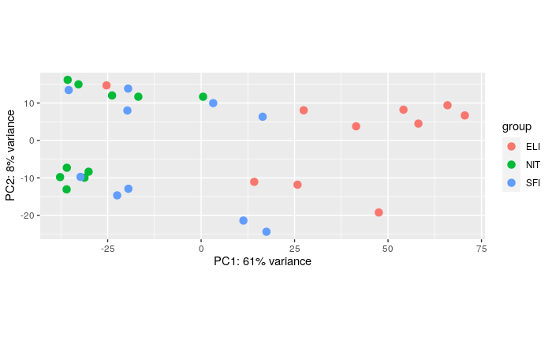

<p>&nbsp;</p>
<p>&nbsp;</p>

\begin{center}
Repositorio GitHub: https://github.com/amarrod96/PEC2
\end{center}


## 1 Abstract

El projecto Expresión Genotipo-Tejido (The Genotype-Tissue Expression project) es un esfuerzo en marcha que pretende construir una base de datos pública para estudiar la expreisón y regulación de genes específicos de tejido. Haciendo uso de esta base de datos, emplearemos diferentes procedimientos computacionales para realizar un análisis de expresión génica diferencial entre distintos grupos de muestras: tejidos infiltrados, pequeños infiltrados focales y infiltrados linfoides extensivos. 

#### 1.1 Key Words

*The Genotype-Tissue Expression project, Expresión génica diferencial, RNA-seq, Homo sapiens*

## 2 Objetivos

El principal objetivo de este trabajo es analizar los datos provenientes del proyecto **The Genotype-Tissue Expression (GTEx) project**. En concreto, tendremos que analizar 10 muestras aleatorias de cada uno de los grupos y comprobar qué diferencias existen a nivel de expresión génica entre ellos. 


## 3 Materiales y Métodos

Las muestras, según lo descrito por el GTEx, fueron recogidas a partir de 54 puntos de tejidos no dañados presentes en unos 1000 individuos, con el objetivo de realizar estudios genómicos y transcriptómicos. 

Para realizar el análisis correspondiente, se empleó el software estadístico R (versión 3.6.3) con los siguientes paquetes descargados a través de los repositorios Bioconductor y CRAN:

* "DESeq2"
* "dplyr"
* "ggplot2"
* "corrplot"
* "pheatmap"
* "RColorBrewer"
* "ggbeeswarm"
* "ensembldb"
* "egg"
* "clusterProfiler"
* "DOSE"
* "org.Hs.eg.db"
* "AnnotationDbi"
* "genefilter"

El procedimiento de análisis consistió en las siguientes etapas:

* **Creación del espacio de trabajo**
   * Generación de la estructura de ficheros y las carpetas necesarias para el análisis
* **Descarga de datos, identificación de grupos y asignación de muestras**
   * Descarga de los ficheros proporcionados por el profesor de la asignatura
   * Obtención de 10 muestras aleatorias por cada grupo de muestras
* **Control de calidad de los datos**
   * Realización de control de calidad de los datos rutinario comprobando homogeneidad en la profundidad de la secuenciación y otros parámetros
* **Preprocesado de los datos: filtraje y normalización**
   * Eliminación de genes no expresados y normalización los valores de lecturas en función 
* **Identificación de genes diferencialmente expresados**
   * Realización test de significancia estadística para comprobar qué genes poseen unos niveles de expresión por encima de lo esperado. 
* **Anotación de los resultados**
   * En esta etapa se asignan los diferentes identificadores con los genes correspondientes en diferentes bases de datos a fin de poder realizar análisis más exhaustivos. 
* **Comparación entre distintos tejidos**
   * En este caso, se comprueban qué genes son los que se encuentran diferencialmente expresados en cada tejido. 
* **Análisis de significación biológica**
   * Finalmente, se realizan análisis de enriquecimiento para comprobar qué rutas biológicas se encuentran asociadas a los cambios transcripcionales. 

A continuación, se representa de forma gráfica el pipeline ejecutado y se detallan los paquetes o comandos empleados en cada etapa del proceso


{width=140px}

Todos los pasos y comandos ejecutados se encuentran en la sección Apéndice, desde donde se pueden ejecutar de forma reproducible desde el archivo *.Rmd*

## 4 Resultados

#### 4.1 Normalización de los datos y control de calidad

Como hemos resaltado anteriormente, el primer paso de la metodología consiste en una comprobación de la calidad de los datos antes y después de la normalización. A continuación se muestra un gráfico *boxplot* que muestra la distribución de las lecturas en todas las muestras, de modo que gráficamente se puede comprobar si son comparables entre sí . Las órdenes ejecutadas para la obtención de los gráficos puede consultarse en el Apéndice. Como vemos, tras la normalización, las distribuciones se asemejan entre sí y se tornan comparables, cosa que no ocurría antes de normalizar, pues la propia variabilidad en la profundidad de secuenciación induce cambios en los valores globalesque no han de ser considerados. Dependiendo del proceso de normalización, se puede tener en cuenta el tamaño de la librería (profundidad de secuenciación), la longitud de los genes, y la composición de la muestra. En este caso concreto, se ha empleado la normalización **rlog**, que únicamente tiene en cuenta el tamaño de librería. Además, en este caso se han eliminado todas aquellas lecturas que poseen 1 lectura o menos, a fin de reducir el ruido y posibles errores con la ejecución del script.


<center>
 
</center>
\begin{center}
Figura 1. Tamaño de las librerías (o número de lecturas) en cada muestra
\end{center}


<center>

</center>
\begin{center}
Figura 2. Porcentaje de genes eliminados del análisis en cada muestra debido a bajo número de lecturas
\end{center}

<p>&nbsp;</p>

Para comprobar los efectos de la normalización, podemos representar gráficamente las distintas normalizaciones. En este caso hemos decidido emplear la normalización rlog debido al número de muestras (n=30), y debido a la variabilidad en la profundidad de secuenciación

</center>
\begin{center}
Figura 3. Comparación de condiciones en función de distintas normalizaciones
\end{center}
<center>

<center>
{width=49%} 
{width=49%}
</center>

\begin{center}
Figura 4. Comparación de las distribuciones de lecturas antes (izq) y después de normalizar (dcha) con la función rlog.
\end{center}

<p>&nbsp;</p>

Además del *boxplot*, también podemos realizar un análisis *PCA* para comprobar la variabilidad de las muestras. En este caso, podemos intuir que las muestras provenientes del grupo ELI son bastante más variables que el resto. Además, podemos comprobar el efecto de otros parámetros además del tipo de tejido, como por ejemplo el sexo del donante. Como podemos observar, el sexo también parece jugar un papel importante. Para intentar comprender mejor cuáles pueden ser los efectos de los grupos, podemos realizar un Heatmap y un Dendrograma, lo que nos clasificará las muestras y ordenará en función de su similitud medida en distancia. 

<center>
{width=49%} 
{width=49%}
</center>

\begin{center}
Figura 5. Análisis de los componentes principales en la muestra tras normalizar
\end{center}


<center>

</center>

\begin{center}
Figura 6. Heatmap y dendrograma que muestra la ordenación de las muestras según las distancias en la expresión del transcriptoma
\end{center}

Como podemos ver, las muestras ELI se agrupan casi todas de forma independiente al resto, mientras que las muestras SFI y NIT parecen no formar dos grupos claros independientes, por lo cual podemos asumir bastante semejanza. 

#### 4.2 Genes diferencialmente expresados

Si un gen se expresa de manera diferencial, se espera que haya cierta diferencia entre los grupos y, por lo tanto, la varianza global del gen será mayor que la de los que no tienen expresión diferencial. El trazado de la variabilidad global de todos los genes es útil para decidir qué porcentaje de los genes muestra una variabilidad que puede atribuirse a causas distintas de la variación aleatoria. Si analizamos en más detalle los genes diferencialmente expresados en cada condición, podemos esclarecer cuáles son aquellas que suponen una mayor perturbación a nivel transcripcional para la célula, y que de este modo pueden explicar las diferencias a nivel de tejido.
<p>&nbsp;</p>

<center>
{width=49%} {width=49%}
</center>
\begin{center}
Figura 7. Boxplot representando la diferencia de expresión en el gen que mayores diferencias presenta
\end{center}

Como podemos observar, el gen con mayores diferencias en la expresión entre muestras da cuenta de la existencia de cierta similitud entre las muestras SFI y MIT, mientras que las muestras ELI parecen poseer unos niveles de expresión mucho más altos. Para comprobar si esto existe de manera sistemáticas en los genes que poseen mayor expresión diferencial, tomamos los 100 genes con mayor "fold-change" y los clusterizamos para comprobar los patrones de agrupamiento y ordenación. 

<p>&nbsp;</p>
<center>
{width=80%}
</center>

\begin{center}
Figura 8. Heatmap con los genes seleccionados y dendrograma que muestra su ordenamiento según los patrones de expresión
\end{center}

Como podemos observar, estos genes de nuevo ponen de manifiesto los resultados anteriores. Además, también se puede observar una agrupación por sexos biológicos, lo que revela que en este caso las diferencias debidas a sexos pueden ayudar a clasificar mejor las muestras que las diferencias debidas a diferencia de tejido. 


#### 4.3 Rutas biológicas alteradas

Tras realizar la anotación de los genes diferencialmente expresados y unos análisis previos, procedemos a comprobar en qué rutas biológicas o localizaciones se encuentran involucrados los genes expresados de forma diferencial. Como vemos en los siguientes gráficos, los genes pueden agruparse según su ontología para dar cuenta de en qué procesos biológicos están involucrados o en qué componentes celulares se encuentran. En este caso, solamente vamos a comparar las muestras ELI vs NIT y ELI vs SFI, ya que entre SFI y NIT no se encuentran diferencias apreciables que puedan dar lugar a unas conclusiones relevantes. 


<center>
{width=49%}
{width=49%}
</center>

\begin{center}
Figura 9. Procesos biológicos enriquecidos en la comparación ELI vs NTI (izq) y ELI vs SFI (dcha)
\end{center}

Si bien observamos ciertas diferencias entre SFI y las otras dos, ambas parecen estar indicando una cambio generalizado en los patrones de expresión de genes involucrados en las mismas rutas o respuestas. La mayoría de ellas están relacionadas con la función inmune, y en concreto con la regulación de leucocitos y linfocitos T.

Por último, a modo de muestra, la red de cosignificancia de los procesos diferencialmente expresados en los distintos grupos de muestras. La información que muestran es bastante similar a la anterior. 

<center>
{width=49%} 
{width=49%} 
</center>

\begin{center}
Figura 10. Red de cosignificancia de procesos biológicos enriquecidos. A la izquierda la comparación ELI vs NTI, y a la derecha ELI vs SFI.
\end{center}

Por último, también lo podemos representar en forma de estructura ramificada jerárquica, que muestra los procesos según relaciones de causalidad y generalidad.
<center>
{width=49%} {width=49%}</center>
\begin{center}
Figura 11. 
\end{center}

## 5 Discusión

En este caso, vemos como los diferentes tejidos muestran unos patrones de expresión diferencial. Las diferencias más relevantes se encuentran entre las muestras ELI y las muestras NIT y SFI. Según los resultados recogidos anteriormente, entre ambos grupos se observa una diferencia significativa y generalizada, que involucra a diversos genes que actúan en las mismas rutas o procesos biológicos. En especial, las funciones que presentan mayores diferencias a lo largo de estos tejidos están relacionadas con la inmunidad, los leucocitos y los linfocitos. Si nos atenemos a la descripción de las muestras, podemos comprobar que ELI proviene de infiltrados de linfocitos, mientras que los otros dos grupos provienen de tejido no infiltrado o pequeños infiltrados focales, lo cual le daría un sentido biológico sensato a las diferencias observadas. 


## 6 Apéndice

Pasos previos: configuración e instalación de paquetes necesarios

Carga de paquetes

```{r echo = T, results = 'hide',message=FALSE,warning=FALSE,fig.show='hide',cache=TRUE}
library("DESeq2")
library("dplyr")
library("ggplot2")
library("corrplot")
library("pheatmap")
library("RColorBrewer")
library("ggbeeswarm")
library("ensembldb")
library("egg")
library("clusterProfiler")
library("DOSE")
library("org.Hs.eg.db")
library("AnnotationDbi")
library("genefilter")
```

Carga de ficheros

```{r echo = T, results = 'hide',message=FALSE,warning=FALSE,fig.show='hide',cache=TRUE}
counts = read.table(file="/home/mario/Downloads/archivos targets y counts/counts.csv",sep=";",header=TRUE,row.names = 1)
targets = read.table(file="/home/mario/Downloads/archivos targets y counts/targets.csv",sep=",",header=TRUE,row.names = 1)
```

Seleccionamos las muestras de forma aleatoria con la función **sample** con la semilla "123"
```{r echo = T, results = 'hide',message=FALSE,warning=FALSE,fig.show='hide',cache=TRUE}
set.seed(111)
NIT = targets[sample(which(targets$Group=="NIT"),10),]
NIT.counts = counts[, NIT$Sample_Name]

SFI = targets[sample(which(targets$Group=="SFI"),10),]
SFI.counts = counts[, SFI$Sample_Name]

ELI = targets[sample(which(targets$Group=="ELI"),10),]
ELI.counts = counts[, ELI$Sample_Name]

counts.subseq = cbind(NIT.counts,SFI.counts,ELI.counts)
targets.subseq = rbind (NIT,SFI,ELI)
```

Generamos gráficos de barras para comprobar el tamaño de las muestras

```{r echo = T, results = 'hide',message=FALSE,warning=FALSE,fig.show='hide',cache=TRUE}
set.seed(222)
plot_data = as.data.frame(colSums(counts.subseq[,1:30]))
plot_data$color = c(rep(1,10),rep(2,10),rep(3,10))
groups = c(rep("NIT",10),rep("SFI",10),rep("ELI",10))
index = rep(c(1:10),3)
names=levels(paste(groups,index))
names=factor( paste(groups,index), levels=paste(groups,index))

ggplot(data=plot_data, aes(x=names,y=plot_data[,1]/10^6,fill=color)) +
   geom_bar(stat="identity", width=0.8,fill=plot_data$color) + 
   labs(x = "Muestras", y="Millones de lecturas") + 
   theme(axis.text.x = element_text(angle = 90, vjust = 0.5, hjust=1),) +
   geom_hline(yintercept=25, linetype="dashed",color = "blue", size=0.5)
```
```{r echo = T, results = 'hide',message=FALSE,warning=FALSE,fig.show='hide',cache=TRUE}
plot_data$value = (colSums(counts.subseq[,1:30]==0)/(colSums(counts.subseq[,1:30])*100))
ggplot(data=plot_data, aes(x=names,y=value,fill=color)) +
   geom_bar(stat="identity", width=0.8,fill=plot_data$color) + 
   labs(x = "Muestras", y="Porcentaje de genes no expresados") + 
   theme(axis.text.x = element_text(angle = 90, vjust = 0.5, hjust=1),)
```

Convertimos los datos al objeto DESeq y prefiltramos los datos, eliminando transcritos que se acumulan en más de una copia
```{r echo = T, results = 'hide',message=FALSE,warning=FALSE,fig.show='hide',cache=TRUE}
library(DESeq2)
deseq.object <- DESeqDataSetFromMatrix(countData = counts.subseq,colData = targets.subseq,design = ~ Group)

ddsSumExp <- deseq.object[ rowSums('counts'(deseq.object)) > 1, ]

dds <- estimateSizeFactors(deseq.object)
dds <- deseq.object[ rowSums(counts(deseq.object)) > 1, ]
```

Comprobamos el número de genes eliminados del análisis
```{r echo = T, results = 'hide',message=FALSE,warning=FALSE,fig.show='hide',cache=TRUE}
plot_data = as.data.frame(colSums(counts.subseq[,1:30]))
plot_data2 = as.data.frame(colSums(assay(dds)[,1:30]))
plot_data[,1] = plot_data[,1]-plot_data2[,1]
plot_data$color = c(rep(1,10),rep(2,10),rep(3,10))
groups = c(rep("NIT",10),rep("SFI",10),rep("ELI",10))
index = rep(c(1:10),3)
names=levels(paste(groups,index))
names=factor( paste(groups,index), levels=paste(groups,index))

ggplot(data=plot_data, aes(x=names,y=plot_data[,1],fill=color)) +
   geom_bar(stat="identity", width=0.8,fill=plot_data$color) + 
   labs(x = "Muestras", y="Número de lecturas eliminadas") + 
   theme(axis.text.x = element_text(angle = 90, vjust = 0.5, hjust=1),)
```

Comprobamos los efectos de la normalización
```{r echo = T, results = 'hide',message=FALSE,warning=FALSE,fig.show='hide',cache=TRUE}
library(dplyr)
dds2 <- estimateSizeFactors(dds)
rld <- rlog(dds, blind = FALSE)
vsd <- vst(dds, blind = FALSE)
df <- bind_rows(
  as_data_frame(log2(counts(dds2, normalized=TRUE)[, 1:2]+1)) %>%
         mutate(transformation = "log2(x + 1)"),
  as_data_frame(assay(vsd)[, 1:2]) %>% mutate(transformation = "vst"),
  as_data_frame(assay(rld)[, 1:2]) %>% mutate(transformation = "rlog"))
colnames(df)[1:2] <- c("x", "y")  

ggplot(df, aes(x = x, y = y)) + geom_hex(bins = 80) +
  coord_fixed() + facet_grid( . ~ transformation)  
```

Como tenemos 30 muestras y hay variabilidad de profundidad de secuenciación, decidimos normalizar con rlog. Comprobamos las distribuciones antes y después de normalizar

Antes de normalizar
```{r echo = T, results = 'hide',message=FALSE,warning=FALSE,fig.show='hide',cache=TRUE}
pseudoCount = log2(assay(dds) + 1)
boxplot(pseudoCount,las=2)
```
Después de normalizar
```{r echo = T, results = 'hide',message=FALSE,warning=FALSE,fig.show='hide',cache=TRUE}
boxplot(as.data.frame(assay(rld)),las=2)
```

Distancia entre las muestras
```{r echo = T, results = 'hide',message=FALSE,warning=FALSE,fig.show='hide',cache=TRUE}
library("RColorBrewer")
library("pheatmap")
sampleDists <- dist(t(assay(rld)))
sampleDistMatrix <- as.matrix( sampleDists )
rownames(sampleDistMatrix) <- rld$Group
colnames(sampleDistMatrix) <- NULL
colors <- colorRampPalette( rev(brewer.pal(9, "Spectral")) )(255)
pheatmap(sampleDistMatrix,
         clustering_distance_rows = sampleDists,
         clustering_distance_cols = sampleDists,
         col = colors)
```

```{r echo = T, results = 'hide',message=FALSE,warning=FALSE,fig.show='hide',cache=TRUE}
plotPCA(vsd, intgroup = c("Group"))
```

```{r echo = T, results = 'hide',message=FALSE,warning=FALSE,fig.show='hide',cache=TRUE}
mds <- as.data.frame(colData(rld))  %>%
         cbind(cmdscale(sampleDistMatrix))
ggplot(mds, aes(x = `1`, y = `2`, color = Group, shape = sex)) +
  geom_point(size = 3) + coord_fixed()
```

Vamos a establecer el umbral de significancia en alfa=0.05 y log2(fold-change)=1. Hacemos todas las comparaciones posibles
```{r echo = T, results = 'hide',message=FALSE,warning=FALSE,fig.show='hide',cache=TRUE}
dds_pipelined <- DESeq(dds2, parallel =TRUE)
res <- results(dds_pipelined,lfcThreshold=1,alpha = 0.5)
ELIvsNIT <- results(dds_pipelined, contrast=c("Group","ELI","NIT"),lfcThreshold=0.5,alpha = 0.05)
NITvsSFI <- results(dds_pipelined, contrast=c("Group","NIT","SFI"),lfcThreshold=0.5,alpha = 0.05)
ELIvsSFI <- results(dds_pipelined, contrast=c("Group","ELI","SFI"),lfcThreshold=0.5,alpha = 0.05)
table(ELIvsNIT$padj < 0.1)
table(ELIvsSFI$padj < 0.1)
table(NITvsSFI$padj < 0.1)
```

Observamos las diferencias entre el gen con mayor "fold-change"
```{r echo = T, results = 'hide',message=FALSE,warning=FALSE,fig.show='hide',cache=TRUE}
topGene <- rownames(res)[which.min(res$padj)]
geneCounts <- plotCounts(dds2, gene = topGene, intgroup = c("Group"),
                         returnData = TRUE)
ggplot(geneCounts, aes(x = Group, y = count)) +
  scale_y_log10() + geom_boxplot() + geom_point(size = 3,alpha=0.1) + theme_classic() + 
   labs(x = "Tipo de Tejido", y="Counts")


```

Lo volvemos a repetir para las tres condiciones
```{r echo = T, results = 'hide',message=FALSE,warning=FALSE,fig.show='hide',cache=TRUE}
library(ggpubr)
topGene <- rownames(ELIvsNIT)[which.min(ELIvsNIT$padj)]
geneCounts <- plotCounts(dds2, gene = topGene, intgroup = c("Group"),
                         returnData = TRUE)
dataframe = geneCounts[geneCounts$Group != 'SFI',]

p1 = ggplot(dataframe, aes(x = Group, y = count)) +
  scale_y_log10() + geom_boxplot() + geom_point(size = 3,alpha=0.1) + theme_classic() + 
   labs(x = "Tipo de Tejido", y="Counts") +  ggtitle("ELI vs NIT")


topGene <- rownames(NITvsSFI)[which.min(NITvsSFI$padj)]
geneCounts <- plotCounts(dds2, gene = topGene, intgroup = c("Group"),
                         returnData = TRUE)
dataframe = geneCounts[geneCounts$Group != 'ELI',]
p2 = ggplot(dataframe, aes(x = Group, y = count)) +
  scale_y_log10() + geom_boxplot() + geom_point(size = 3,alpha=0.1) + theme_classic() + 
   labs(x = "Tipo de Tejido", y="Counts") + ggtitle("NIT vs SFI")


topGene <- rownames(ELIvsSFI)[which.min(ELIvsSFI$padj)]
geneCounts <- plotCounts(dds2, gene = topGene, intgroup = c("Group"),
                         returnData = TRUE)
dataframe = geneCounts[geneCounts$Group != 'NIT',]
p3 = ggplot(dataframe, aes(x = Group, y = count)) +
  scale_y_log10() + geom_boxplot() + geom_point(size = 3,alpha=0.1) + theme_classic() + 
   labs(x = "Tipo de Tejido", y="Counts") + ggtitle("ELI vs SFI")

ggarrange(p1,p2,p3,ncol=3)
```

Realizamos un clustering con 100 genes
```{r echo = T, results = 'hide',message=FALSE,warning=FALSE,fig.show='hide',cache=TRUE}
topVarGenes <- head(order(rowVars(assay(rld)), decreasing = TRUE),100)

mat  <- assay(rld)[topVarGenes, ]
mat  <- mat - rowMeans(mat)
anno <- as.data.frame(colData(rld)[, c("Group","sex")])
pheatmap(mat, annotation_col = anno)
```


```{r echo = T, results = 'hide',message=FALSE,warning=FALSE,fig.show='hide',cache=TRUE}
library("AnnotationDbi")
library("org.Hs.eg.db")
rownames(ELIvsNIT) =  gsub("\\..*","",row.names(ELIvsNIT))
ELIvsNIT$symbol <- mapIds(org.Hs.eg.db,
                     keys=row.names(ELIvsNIT),
                     column="SYMBOL",
                     keytype="ENSEMBL",
                     multiVals="first")

rownames(NITvsSFI) =  gsub("\\..*","",row.names(NITvsSFI))
NITvsSFI$symbol <- mapIds(org.Hs.eg.db,
                     keys=row.names(NITvsSFI),
                     column="SYMBOL",
                     keytype="ENSEMBL",
                     multiVals="first")

rownames(ELIvsSFI) =  gsub("\\..*","",row.names(ELIvsSFI))
ELIvsSFI$symbol <- mapIds(org.Hs.eg.db,
                     keys=row.names(ELIvsSFI),
                     column="SYMBOL",
                     keytype="ENSEMBL",
                     multiVals="first")
```

Análisis funcional ELIvsNIT
```{r echo = T, results = 'hide',message=FALSE,warning=FALSE,fig.show='hide',cache=TRUE}
library(clusterProfiler)
na.omitELIvsNIT=ELIvsNIT[!is.na(ELIvsNIT$padj), ]
na.omitELIvsNIT<-na.omitELIvsNIT[na.omitELIvsNIT$padj < 0.1,]

na.omitNITvsSFI=NITvsSFI[!is.na(NITvsSFI$padj), ]
na.omitNITvsSFI<-na.omitNITvsSFI[na.omitNITvsSFI$padj < 0.1,]

na.omitELIvsSFI=ELIvsSFI[!is.na(ELIvsSFI$padj), ]
na.omitELIvsSFI<-na.omitELIvsSFI[na.omitELIvsSFI$padj < 0.1,]

genes.elvsni = na.omit(na.omitELIvsNIT$symbol)
bkgenes.elvsni = na.omit(ELIvsNIT$symbol)

genes.nivssf = na.omit(na.omitNITvsSFI$symbol)
bkgenes.nivssf = na.omit(NITvsSFI$symbol)

genes.elvssf = na.omit(na.omitELIvsSFI$symbol)
bkgenes.elvssf = na.omit(ELIvsSFI$symbol)

elvsni <- enrichGO(gene          = genes.elvsni,
                universe      = bkgenes.elvsni,
                OrgDb         = org.Hs.eg.db,
                keyType = 'SYMBOL',
                ont           = "BP",
                pAdjustMethod = "BH",
                pvalueCutoff  = 0.01,
                qvalueCutoff  = 0.05)

nivssf  <- enrichGO(gene          = genes.nivssf,
                universe      = bkgenes.nivssf,
                OrgDb         = org.Hs.eg.db,
                keyType = 'SYMBOL',
                ont           = "BP",
                pAdjustMethod = "BH",
                pvalueCutoff  = 0.01,
                qvalueCutoff  = 0.05)

elvssf <- enrichGO(gene          = genes.elvssf,
                universe      = bkgenes.elvssf,
                OrgDb         = org.Hs.eg.db,
                keyType = 'SYMBOL',
                ont           = "BP",
                pAdjustMethod = "BH",
                pvalueCutoff  = 0.01,
                qvalueCutoff  = 0.05)

options(scipen=3)
dotplot(elvsni, showCategory=10)
dotplot(nivssf, showCategory=10)
dotplot(elvssf, showCategory=10) 

emapplot(elvsni,showCategory = 15)
emapplot(elvssf,showCategory = 15)

plotGOgraph(elvsni)
plotGOgraph(elvssf)
```


